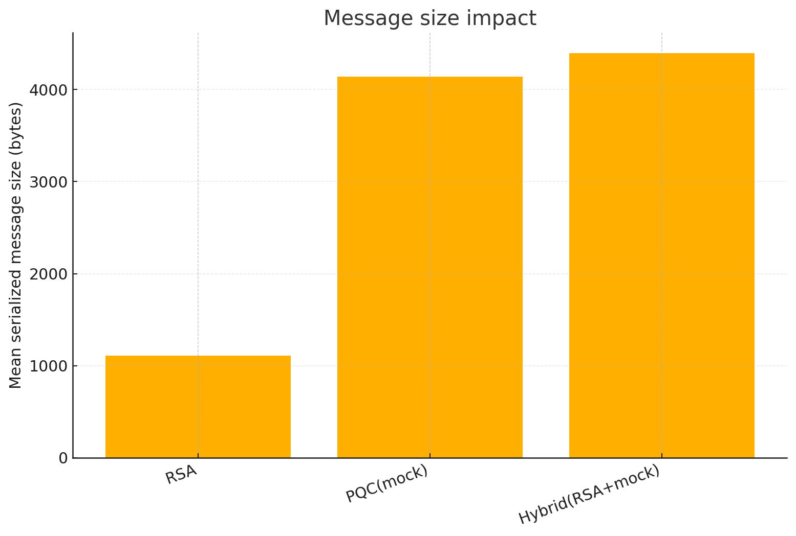
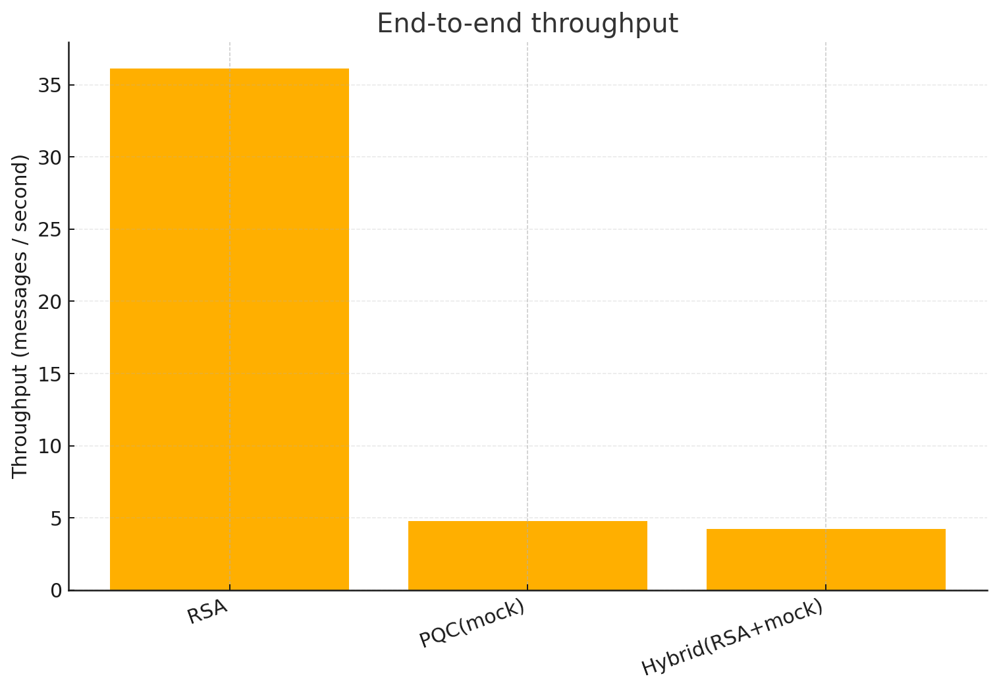
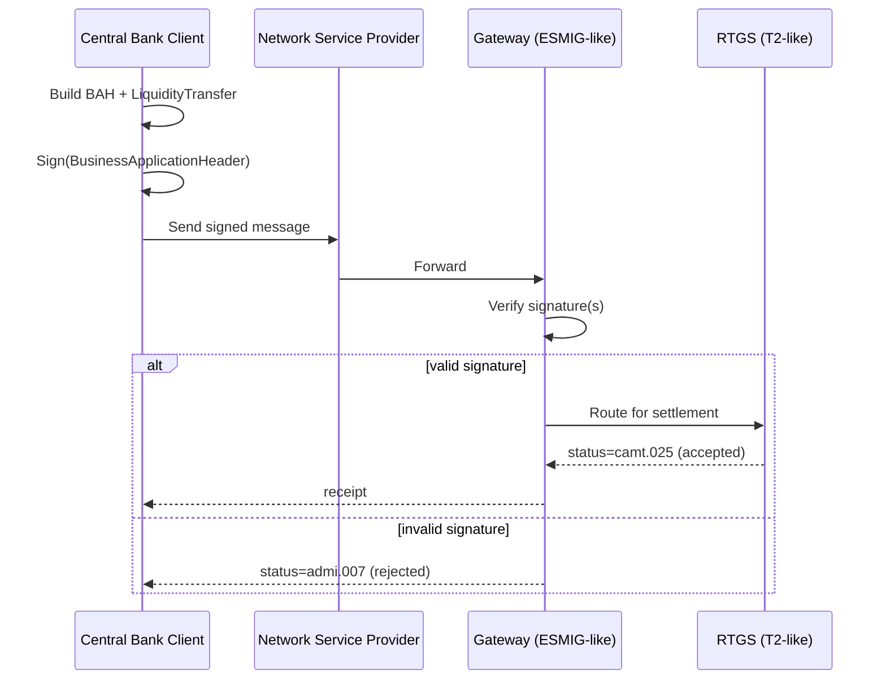

# leap-phase2-pqc-payment-sim

A small, **Phase-2-style** toy project that simulates **RTGS liquidity transfer messages** whose **Business Application Header (BAH)** signature is swapped from **traditional RSA** to a **post-quantum signature** (PQC), while keeping the **end-to-end message flow** intact.

This repo is inspired by **BIS Innovation Hub – Project Leap Phase 2** (Dec 11, 2025), which tested **PQC signatures for liquidity transfers in the Eurosystem’s TARGET2 (T2)** system.

> ⚠️ **Disclaimer (very important):**  
> This is **not** TARGET2, not SWIFT, and not a production cryptosystem.  
> It is an **educational simulator** focused on *migration mechanics* (message formats, verification points, performance/size impacts, hybrid patterns, failure modes).

---

## Why this exists

Project Leap Phase 2 is notable because it went beyond “lab crypto” and asked:

- **Can we replace the in-flight payment signature scheme with PQC and still complete the liquidity-transfer workflow end-to-end?**
- What breaks (performance, interoperability, operational complexity)?

In the Phase 2 report, the BAH signature (RSA in the current system) was replaced by **CRYSTALS-Dilithium** (NIST Round 3, security strength category 3), and the team measured **signature verification** overheads.  
They report an average verification time of **~209.9 ms** (PQC) vs **~28.1 ms** (traditional) in their experimental setup (order-of-magnitude gap).

This repo gives you a way to reproduce the **shape of that experiment** with:

- A simplified payment message (BAH + document)
- A configurable verifier placement (gateway)
- RSA vs PQC vs hybrid signatures
- Fault-injection tests (invalid signature, unknown key/cert)
- Benchmarks + charts you can share

References:
- BIS Project Leap Phase 2 report (Dec 11, 2025): https://www.bis.org/publ/othp107.htm
- Banca d’Italia announcement (Dec 11, 2025): https://www.bancaditalia.it/media/notizia/project-leap-phase-2-results-of-testing-quantum-resistant-cryptography-in-real-world-payment-systems/
- BIS Papers No. 158 (Quantum-readiness roadmap, Jul 7, 2025): https://www.bis.org/publ/bppdf/bispap158.htm
- BIS Press Release (Project Leap Phase 1, Jun 5, 2023): https://www.bis.org/press/p230605.htm

---

## What you can run

### 1) Payment-flow PQC migration simulator
- `RSA-PSS` (traditional baseline, matching the Phase-2 “BAH uses RSA” idea)
- `Mock-PQC` (runs everywhere; emulates **large signatures** and **higher CPU cost**)
- Optional **liboqs** backend (real PQC) if you install it yourself
- Hybrid mode (RSA + PQC in parallel), to illustrate “crypto agility / phased migration”

### 2) (Optional) Quantum threat demo with PennyLane
A **tiny Shor period-finding demo** for factoring **N=15** (toy).  
This is *only* to help non-cryptographers understand why RSA/ECDSA-class schemes are threatened by Shor.

> This is *not* a realistic attack on modern key sizes; it’s a learning demo.

---

## Repo structure

```
.
├── src/leap_pqc_sim/
│   ├── models.py                  # BAH + LiquidityTransfer message models
│   ├── canonical.py               # canonical JSON serialization for signing
│   ├── crypto/
│   │   ├── base.py                # signer/verifier interfaces + helpers
│   │   ├── rsa_pss.py             # RSA-PSS signer
│   │   ├── mock_pqc.py            # mock PQC signer (size + CPU cost)
│   │   └── oqs_dilithium.py        # optional liboqs-python backend (if installed)
│   └── sim/
│       ├── pipeline.py            # “client -> NSP -> gateway -> RTGS” flow
│       └── stats.py               # summary stats helpers
├── scripts/
│   ├── run_simulation.py          # run a benchmark (rsa/pqc/hybrid)
│   ├── generate_figures.py        # make plots from results/*.json
│   └── shor_demo_pennylane.py     # optional PennyLane demo (N=15)
├── results/                       # benchmark output JSON
├── figures/                       # generated charts (PNG)
└── README.md
```

---

## Quickstart (no PQC dependencies required)

### 0) Create a virtualenv & install deps

```bash
python -m venv .venv
source .venv/bin/activate  # Windows: .venv\Scripts\activate
pip install -r requirements.txt
```

### 1) Run RSA baseline

```bash
python scripts/run_simulation.py --mode rsa --n 200 --concurrency 8 --out results/rsa.json
```

### 2) Run PQC mode (mock PQC by default)

```bash
python scripts/run_simulation.py --mode pqc --n 200 --concurrency 8 --out results/pqc.json
```

### 3) Run hybrid

```bash
python scripts/run_simulation.py --mode hybrid --n 200 --concurrency 8 --out results/hybrid.json
```

### 4) Generate charts

```bash
python scripts/generate_figures.py --inputs results/rsa.json results/pqc.json results/hybrid.json --outdir figures
```

---

## Example charts (generated from bundled example data)

Below are example plots produced with synthetic distributions aligned to the Phase-2 report’s “order-of-magnitude” verification gap.





---

## How this maps to Project Leap Phase 2

In the Phase 2 report, the flow includes a client, an NSP, a gateway (ESMIG), and the RTGS (T2).  
The signature of interest is on the **Business Application Header (BAH)** and is verified early.

This repo implements a simplified analogue:



Key Phase-2 details explicitly reflected here:
- The **BAH signature** is swapped from **RSA** to **Dilithium-like PQC**.
- We include a **bulk test** mode similar to “send a bulk of 50 messages” used in the report.
- We include **fault injection** (invalid signature / unknown key) and measure rejection.
- We include **hybrid mode** because the report discusses hybrid as recommended but hard to implement.

---

## Installing a *real* PQC backend (optional)

This repo supports **liboqs-python** (`import oqs`) if you install it.

- liboqs-python: https://github.com/open-quantum-safe/liboqs-python
- liboqs: https://github.com/open-quantum-safe/liboqs

Because liboqs is a compiled dependency, installation is platform-specific.  
If `oqs` is available, run:

```bash
python scripts/run_simulation.py --mode pqc --pqc-backend oqs --oqs-alg Dilithium3 --out results/pqc_oqs.json
```

If not installed, the simulator automatically falls back to `mock-pqc`.

---

## Notes on metrics & interpretation

- `verification_time_ms`: time spent verifying the BAH signature(s) at the gateway.
- `message_size_bytes`: serialized message size including signatures (proxy for bandwidth / storage).
- `throughput_msg_per_s`: end-to-end completed messages / wall-time.

> The bundled mock PQC is designed to make **size & cost differences obvious**, not to be a perfect benchmark.
> For production-grade benchmarking, use real PQC libraries, realistic HSMs, and representative message sizes.

---

## License

MIT (see `LICENSE`).

